# 🏗️ Trash Talk App - Architecture Diagrams

This document contains comprehensive architecture diagrams for the Trash Talk (Eco-Eco) waste classification application, rendered using Mermaid syntax for beautiful visualization.

---

## System Architecture Overview


---

## Request Flow: Image Classification


---

## Authentication Flow

```mermaid
flowchart TD
    Start([User]) --> Nav[Navigate to /auth]
    Nav --> AuthPage[Auth Page<br/>- Login form<br/>- Signup form]
    AuthPage --> Submit[Submit credentials]
    Submit --> AuthCtx[AuthContext<br/>AuthContext.tsx<br/>- login()<br/>- signup()]
    AuthCtx -->|Firebase Auth SDK| FirebaseAuth[Firebase Authentication<br/>Cloud Service<br/>- Email verification<br/>- Password hashing<br/>- Token generation]
    FirebaseAuth -->|Auth Token + User| UpdateCtx[AuthContext Update<br/>- Set user state<br/>- Set loading false]
    UpdateCtx --> CreateProfile[Create profile doc]
    CreateProfile --> Firestore["Firestore<br/>/users/[uid]<br/>- Initial profile<br/>- Timestamps"]
    Firestore --> Redirect[Redirect to Protected Pages]
    Redirect --> Pages[Protected Pages<br/>- Dashboard<br/>- Upload<br/>- Profile]
    Pages --> End([User Authenticated])
    
    style Start fill:#e1f5ff
    style End fill:#c8e6c9
    style FirebaseAuth fill:#fff9c4
    style Firestore fill:#f3e5f5
```

---

## Profile Photo Upload Flow

```mermaid
flowchart TD
    Start([User]) --> Click[Click Change button]
    Click --> FileInput[File Input<br/>- accept=image/*<br/>- Hidden input]
    FileInput --> Select[File selection]
    Select --> ClientVal[Client Validation<br/>- File type check<br/>- Size < 5MB<br/>- Preview generation]
    ClientVal --> SaveBtn[User clicks Save]
    SaveBtn --> Handler[Upload Handler<br/>handleSave()<br/>- Set saving=true]
    Handler --> Upload[Upload to Storage]
    Upload --> FirebaseStorage["Firebase Storage<br/>profiles/[uid]/<br/>avatar-[timestamp].jpg<br/>- Resumable upload<br/>- Progress tracking"]
    FirebaseStorage --> GetURL[Get download URL]
    GetURL --> StorageResp[Storage Response<br/>- Public URL<br/>- CDN link]
    StorageResp --> UpdateFS["Update Firestore<br/>/users/[uid]<br/>- photoUrl field<br/>- updatedAt timestamp"]
    UpdateFS --> UpdateUI[Profile Page Update<br/>- Set photoPreview<br/>- Set saving=false<br/>- Show success message]
    UpdateUI --> End([Photo Uploaded])
    
    style Start fill:#e1f5ff
    style End fill:#c8e6c9
    style FirebaseStorage fill:#fff9c4
    style UpdateFS fill:#f3e5f5
```

---

## Model Training Pipeline


---

## Database Schema Diagram

```mermaid
erDiagram
    USER ||--o| USER_PROFILE : "has"
    USER ||--o{ ANALYSIS : "creates"
    USER ||--o| STATISTICS : "has"
    
    USER {
        string uid PK "Firebase Auth UID"
        string email
        string displayName
        timestamp createdAt
        timestamp lastLogin
    }
    
    USER_PROFILE {
        string userId PK_FK "References USER.uid"
        string name
        string phone
        string email
        string photoUrl "Optional"
        timestamp createdAt
        timestamp updatedAt
    }
    
    ANALYSIS {
        string id PK "Auto-generated"
        string userId FK "References USER.uid"
        string item "Waste item name"
        string category "Recyclable/Compostable"
        number confidence "0-100"
        string tip "Recycling tip"
        number co2 "CO2 saved in kg"
        string imageUrl "Optional"
        timestamp createdAt
    }
    
    STATISTICS {
        string userId PK_FK "References USER.uid"
        number totalItems "Total analyses"
        number recyclable "Recyclable count"
        number compostable "Compostable count"
        number co2Saved "Total CO2 saved"
        json categoryBreakdown "Per-category stats"
        timestamp updatedAt "Last calculation"
    }
```

### Collection Details

**Collection: `users`**
- Document ID: `{userId}` (Firebase Auth UID)
- Fields: name, phone, email, photoUrl, createdAt, updatedAt

**Collection: `analyses`**
- Document ID: `{analysisId}` (Auto-generated)
- Fields: userId, item, category, confidence, tip, co2, imageUrl, createdAt

**Collection: `stats`** (Optional - Computed from analyses)
- Document ID: `{userId}`
- Fields: totalItems, recyclable, compostable, co2Saved, updatedAt

---

## Storage Structure Diagram

```mermaid
graph TD
    Root["🔥 Firebase Cloud Storage<br/>================================<br/>Bucket: trash-talk-5585d.appspot.com"] --> Profiles["📁 profiles/"]
    Profiles --> UserFolder["👤 [userId]/<br/>User-specific folder"]
    UserFolder --> Avatar1["📷 avatar-1699123456789.jpg<br/>Timestamp-based filename"]
    UserFolder --> Avatar2["📷 avatar-1699123567890.png<br/>Multiple formats supported"]
    UserFolder --> Avatar3["📷 ...<br/>Additional avatar files"]
    
    Root -.->|"⚠️ Important Note"| Warning["⚠️ WARNING<br/>================================<br/>Old avatars are NOT automatically deleted<br/>Consider implementing cleanup script for production"]
    
    style Root fill:#1976d2,stroke:#0d47a1,stroke-width:3px,color:#fff
    style Profiles fill:#7b1fa2,stroke:#4a148c,stroke-width:2px,color:#fff
    style UserFolder fill:#f57c00,stroke:#e65100,stroke-width:2px,color:#fff
    style Avatar1 fill:#388e3c,stroke:#1b5e20,stroke-width:2px,color:#fff
    style Avatar2 fill:#388e3c,stroke:#1b5e20,stroke-width:2px,color:#fff
    style Avatar3 fill:#388e3c,stroke:#1b5e20,stroke-width:2px,color:#fff
    style Warning fill:#d32f2f,stroke:#b71c1c,stroke-width:3px,color:#fff
```



---

## Component Hierarchy

```mermaid
graph TD
    App["📱 App<br/>layout.tsx<br/>Root Component"] --> AuthProvider["🔐 AuthProvider<br/>AuthContext.tsx<br/>Authentication State"]
    
    AuthProvider --> Pages["📄 All Pages<br/>Protected Routes"]
    
    Pages --> Landing["🏠 Landing Page<br/>Route: /<br/>Navigation Component"]
    Pages --> Auth["🔑 Auth Page<br/>Route: /auth<br/>Login/Signup Forms"]
    Pages --> Upload["📤 Upload Page<br/>Route: /upload<br/>Navigation + ImageUpload Component"]
    Pages --> Result["📊 Result Page<br/>Route: /result<br/>Navigation + Result Display"]
    Pages --> Dashboard["📈 Dashboard Page<br/>Route: /dashboard<br/>Navigation + StatCard + Charts"]
    Pages --> Profile["👤 Profile Page<br/>Route: /profile<br/>Navigation + Profile Form + Photo Upload"]
    
    style App fill:#1976d2,stroke:#0d47a1,stroke-width:3px,color:#fff
    style AuthProvider fill:#f57c00,stroke:#e65100,stroke-width:2px,color:#fff
    style Pages fill:#7b1fa2,stroke:#4a148c,stroke-width:2px,color:#fff
    style Landing fill:#388e3c,stroke:#1b5e20,stroke-width:2px,color:#fff
    style Auth fill:#d32f2f,stroke:#b71c1c,stroke-width:2px,color:#fff
    style Upload fill:#0288d1,stroke:#01579b,stroke-width:2px,color:#fff
    style Result fill:#5c6bc0,stroke:#283593,stroke-width:2px,color:#fff
    style Dashboard fill:#00796b,stroke:#004d40,stroke-width:2px,color:#fff
    style Profile fill:#c2185b,stroke:#880e4f,stroke-width:2px,color:#fff
```



---

## Technology Stack Visualization

```mermaid
graph TB
    subgraph Frontend["🎨 FrontEND STACK"]
        NextJS[Next.js<br/>Framework]
        React[React<br/>UI Library]
        TS[TypeScript<br/>Language]
        Tailwind[Tailwind CSS<br/>Styling]
        FirebaseSDK[Firebase SDK<br/>Integration]
        Axios[Axios<br/>HTTP Client]
        Recharts[Recharts<br/>Charts]
        Lucide[Lucide<br/>Icons]
    end
    
    subgraph Backend["⚙️ BACKEND STACK"]
        Flask[Flask<br/>Web API]
        TensorFlow[TensorFlow<br/>ML Core]
        Keras[Keras<br/>ML API]
        Pillow[Pillow<br/>Images]
        OpenCV[OpenCV<br/>Vision]
        Gunicorn[Gunicorn<br/>Server]
    end
    
    subgraph Infrastructure["☁️ INFRASTRUCTURE"]
        FirebaseAuth[Firebase Auth<br/>Authentication]
        Firestore[Firebase Firestore<br/>Database]
        FirebaseStorage[Firebase Storage<br/>File Storage]
    end
    
    Frontend --> Infrastructure
    Backend --> Infrastructure
    
    style Frontend fill:#e3f2fd
    style Backend fill:#fff3e0
    style Infrastructure fill:#f1f8e9
```



---

## Data Flow: Complete System


---

## Deployment Architecture

```mermaid
graph TB
    subgraph Production["🚀 PRODUCTION ENVIRONMENT"]
        subgraph FrontendDeploy["Frontend Deployment"]
            Vercel[Vercel/Netlify<br/>Next.js Static/SSR]
        end
        
        subgraph BackendDeploy["Backend Deployment"]
            Heroku[Heroku/Railway<br/>Flask + Gunicorn]
        end
        
        subgraph Cloud["Firebase Cloud"]
            AuthCloud[Authentication Service]
            FirestoreCloud[Cloud Firestore]
            StorageCloud[Cloud Storage]
        end
        
        Vercel <-->|REST API| Heroku
        Vercel -->|Firebase SDK| Cloud
        Heroku -->|Model File| ModelStorage[Model Storage<br/>model.h5]
    end
    
    subgraph Development["💻 DEVELOPMENT ENVIRONMENT"]
        DevFrontend[localhost:3000<br/>Next.js Dev Server]
        DevBackend[localhost:5000<br/>Flask Dev Server]
        DevFirebase[Firebase Emulators<br/>or Cloud]
    end
    
    style Production fill:#c8e6c9
    style Development fill:#fff9c4
    style Cloud fill:#e3f2fd
```



---

*These diagrams provide visual representations of the Trash Talk App architecture. All diagrams use Mermaid syntax and can be viewed beautifully with Mermaid extensions in VS Code, GitHub, GitLab, and other markdown viewers.*
