```mermaid
graph TB
    User[👤 User]
    Admin[👨‍💼 Admin]
    System[🖥️ System]
    
    User -->|Register Account| UC1[Register Account]
    User -->|Login| UC2[Login]
    User -->|Logout| UC3[Logout]
    User -->|Upload Waste Image| UC4[Upload Waste Image]
    User -->|View Classification Result| UC5[View Classification Result]
    User -->|View Dashboard| UC6[View Dashboard]
    User -->|View Profile| UC7[View Profile]
    User -->|Update Profile| UC8[Update Profile]
    User -->|Upload Profile Photo| UC9[Upload Profile Photo]
    
    System -->|Authenticate User| UC2
    System -->|Classify Waste| UC4
    System -->|Store Analysis| UC4
    System -->|Calculate Statistics| UC6
    
    UC4 -.->|includes| UC5
    UC6 -.->|includes| UC5
    UC8 -.->|extends| UC7
    UC9 -.->|extends| UC8
```

# 📊 Trash Talk App - System Diagrams

This document contains comprehensive system diagrams for the Trash Talk (Eco-Eco) waste classification application, including Use Case, ER, Activity, Sequence, Class, and State diagrams with detailed explanations.

---

## 1. Use Case Diagram

### Diagram

### Explanation

**Actors:**
- **User**: Primary actor who interacts with the application to classify waste and track their environmental impact
- **Admin**: (Future) Administrator who manages the system
- **System**: The application itself performing automated tasks

**Use Cases:**
1. **Register Account**: User creates a new account with email, password, name, and phone
2. **Login**: User authenticates using email and password via Firebase Auth
3. **Logout**: User ends their session
4. **Upload Waste Image**: User uploads an image of waste for classification
5. **View Classification Result**: User views AI-generated classification with category, confidence, tips, and CO2 savings
6. **View Dashboard**: User views statistics including total items, recyclable/compostable breakdown, and CO2 savings
7. **View Profile**: User views their profile information
8. **Update Profile**: User updates name and phone number
9. **Upload Profile Photo**: User uploads/changes their profile picture

**Relationships:**
- **Includes**: View Classification Result is included in Upload Waste Image and View Dashboard
- **Extends**: Upload Profile Photo extends Update Profile, which extends View Profile

---

## 2. Entity Relationship (ER) Diagram

### Diagram

### Explanation

**Entities:**

1. **USER** (Firebase Auth)
   - Primary Key: `uid` (Firebase User ID)
   - Attributes: email, displayName, createdAt, lastLogin
   - Represents authenticated users in the system

2. **USER_PROFILE** (Firestore Collection: `users`)
   - Primary Key: `userId` (references USER.uid)
   - Attributes: name, phone, email, photoUrl, timestamps
   - Stores extended user profile information
   - One-to-one relationship with USER

3. **ANALYSIS** (Firestore Collection: `analyses`)
   - Primary Key: `id` (auto-generated document ID)
   - Foreign Key: `userId` (references USER.uid)
   - Attributes: item (waste name), category (Recyclable/Compostable), confidence, tip, co2 savings, imageUrl, createdAt
   - Stores each waste classification result
   - Many-to-one relationship with USER (one user can have many analyses)

4. **STATISTICS** (Derived/Computed from ANALYSIS)
   - Primary Key: `userId` (references USER.uid)
   - Attributes: aggregated statistics (totalItems, recyclableItems, compostableItems, co2Saved, categoryBreakdown)
   - Computed from ANALYSIS records for dashboard display
   - One-to-one relationship with USER

**Relationships:**
- USER has one USER_PROFILE (1:1)
- USER creates many ANALYSIS records (1:N)
- STATISTICS is derived from ANALYSIS records for each USER

**Storage:**
- USER: Firebase Authentication
- USER_PROFILE: Firestore `users/{uid}`
- ANALYSIS: Firestore `analyses/{id}`
- STATISTICS: Computed on-demand or cached in localStorage

---

## 3. Activity Diagram

### Diagram

### Explanation

**Main Flows:**

1. **Authentication Flow**
   - User starts app → Check authentication status
   - If not authenticated → Show auth page → User logs in → Create/update profile → Navigate to home

2. **Upload & Analysis Flow**
   - User selects image → Preview → Click analyze → Send to Flask backend
   - Backend preprocesses image → Runs TensorFlow model → Returns prediction
   - Frontend saves result to Firestore → Displays result → Updates statistics

3. **Dashboard Flow**
   - User navigates to dashboard → Load statistics from Firestore
   - Query all analyses for user → Calculate aggregates (totals, CO2, category breakdown)
   - Display charts and metrics using Recharts

4. **Profile Management Flow**
   - User views profile → Optionally edits name/phone → Saves to Firestore
   - Optionally uploads photo → Uploads to Firebase Storage → Updates profile with URL

**Decision Points:**
- Authentication check at app start
- User action selection (upload/dashboard/profile)
- Analyze confirmation
- Edit profile decision
- Upload photo decision

---

## 4. Sequence Diagram

### Diagram

### Explanation

**Key Interactions:**

1. **Authentication Sequence**
   - Frontend calls Firebase Auth SDK
   - Firebase returns authenticated user object
   - Frontend creates/updates user profile in Firestore
   - User is redirected to authenticated pages

2. **Image Classification Sequence**
   - User uploads image → Frontend sends to Flask backend via POST request
   - Backend validates, preprocesses, and runs TensorFlow model inference
   - Model returns prediction probabilities → Backend maps to category
   - Result returned to frontend → Saved to Firestore → Statistics updated
   - User redirected to results page

3. **Dashboard Sequence**
   - Frontend queries Firestore for all user analyses
   - Calculates aggregated statistics client-side
   - Renders charts using Recharts library
   - Displays metrics to user

4. **Profile Photo Upload Sequence**
   - User selects photo → Frontend uploads to Firebase Storage
   - Storage returns public download URL
   - Frontend updates Firestore user document with photoUrl
   - Profile page refreshes to show new photo

**Technology Stack:**
- **Frontend**: Next.js 14, React, TypeScript
- **Backend**: Flask, TensorFlow/Keras
- **Database**: Firestore (NoSQL)
- **Storage**: Firebase Cloud Storage
- **Auth**: Firebase Authentication

---

## 5. Class Diagram

### Diagram

### Explanation

**Backend Classes:**

1. **WastePredictor**
   - **Purpose**: Core ML model wrapper for waste classification
   - **Attributes**: 
     - `model`: Loaded TensorFlow/Keras model
     - `model_loaded`: Boolean flag indicating model status
     - `img_size`: Image preprocessing size (224x224)
     - `WASTE_CATEGORIES`: Static dictionary mapping category IDs to metadata
   - **Methods**:
     - `__init__()`: Initialize and load model
     - `preprocess_image()`: Resize and normalize image for model input
     - `predict()`: Run inference on single image
     - `predict_batch()`: Run inference on multiple images

2. **FlaskApp**
   - **Purpose**: Flask application handling HTTP requests
   - **Attributes**: Flask app instance, WastePredictor instance, configuration
   - **Methods**:
     - `analyze_image()`: POST endpoint for image classification
     - `health()`: Health check endpoint
     - `cleanup_old_files()`: Remove old uploaded files

**Frontend Classes:**

3. **AuthContext**
   - **Purpose**: React Context for authentication state management
   - **Attributes**: Current user, loading state
   - **Methods**: Login, signup, logout operations

4. **UserProfile**
   - **Purpose**: TypeScript interface for user profile data
   - **Attributes**: name, phone, email, photoUrl, timestamps

5. **UserStats**
   - **Purpose**: Statistics aggregation structure
   - **Attributes**: Total items, recyclable/compostable counts, CO2 saved, category breakdown

6. **CategoryMetric**
   - **Purpose**: Per-category statistics
   - **Attributes**: Count and CO2 savings for each category

7. **ImageUpload**
   - **Purpose**: Reusable component for image selection and preview
   - **Methods**: Handle file selection, display preview

8. **UploadPage**
   - **Purpose**: Page component for waste image upload
   - **Methods**: Handle upload, send to backend, navigate to results

9. **DashboardPage**
   - **Purpose**: Page component displaying user statistics
   - **Methods**: Load statistics, render charts

10. **ProfilePage**
    - **Purpose**: Page component for user profile management
    - **Methods**: Load profile, update profile, upload photo

**Relationships:**
- WastePredictor is used by FlaskApp for predictions
- AuthContext manages UserProfile data
- UserStats contains multiple CategoryMetric objects
- Page components use AuthContext for authentication
- UploadPage uses ImageUpload component

---

## 6. State Diagram

### Diagram

### Explanation

**Main States:**

1. **Unauthenticated**
   - Initial state when user is not logged in
   - User can only access public pages (home, auth)
   - Transitions to Authenticating when user attempts login

2. **Authenticating**
   - Temporary state during Firebase authentication
   - Transitions to Authenticated on success
   - Returns to Unauthenticated on failure

3. **Authenticated**
   - User is logged in and can access all features
   - Central hub state that transitions to:
     - Uploading (waste classification)
     - ViewingDashboard (statistics)
     - ViewingProfile (profile management)
   - Returns to Unauthenticated on logout

**Sub-States:**

4. **Uploading State Machine**
   - **ImageSelected**: User has selected a file
   - **ImagePreview**: Image is loaded and displayed
   - **Analyzing**: Request sent to backend, waiting for response
   - **ResultReady**: Analysis complete, ready to display

5. **ViewingDashboard State Machine**
   - **LoadingStats**: Fetching data from Firestore
   - **StatsLoaded**: Data received
   - **DisplayingCharts**: Charts rendered and visible

6. **ViewingProfile State Machine**
   - **LoadingProfile**: Fetching user profile from Firestore
   - **ProfileLoaded**: Profile data available
   - **EditingProfile**: User is editing name/phone
   - **SavingProfile**: Saving changes to Firestore
   - **UploadingPhoto**: User selected photo file
   - **UploadingToStorage**: Uploading to Firebase Storage
   - **UpdatingProfile**: Updating Firestore with photo URL

**State Transitions:**
- All authenticated sub-states can return to Authenticated
- Uploading can transition to ViewingResult
- ViewingResult can return to Uploading or ViewingDashboard
- Profile editing and photo upload are independent flows within ViewingProfile

**Key Features:**
- State persistence via React Context (AuthContext)
- Navigation-based state transitions (Next.js routing)
- Async operations (API calls, Firestore queries) create intermediate states
- Error handling returns to previous valid state

---

## Summary

These diagrams provide a comprehensive view of the Trash Talk App system:

1. **Use Case Diagram**: Shows all user interactions and system capabilities
2. **ER Diagram**: Illustrates data structure and relationships in Firebase
3. **Activity Diagram**: Details the step-by-step workflows for key processes
4. **Sequence Diagram**: Demonstrates component interactions over time
5. **Class Diagram**: Defines the object-oriented structure of the codebase
6. **State Diagram**: Maps application state transitions and user flows

Together, they document the complete architecture, data flow, and user experience of the waste classification application.

